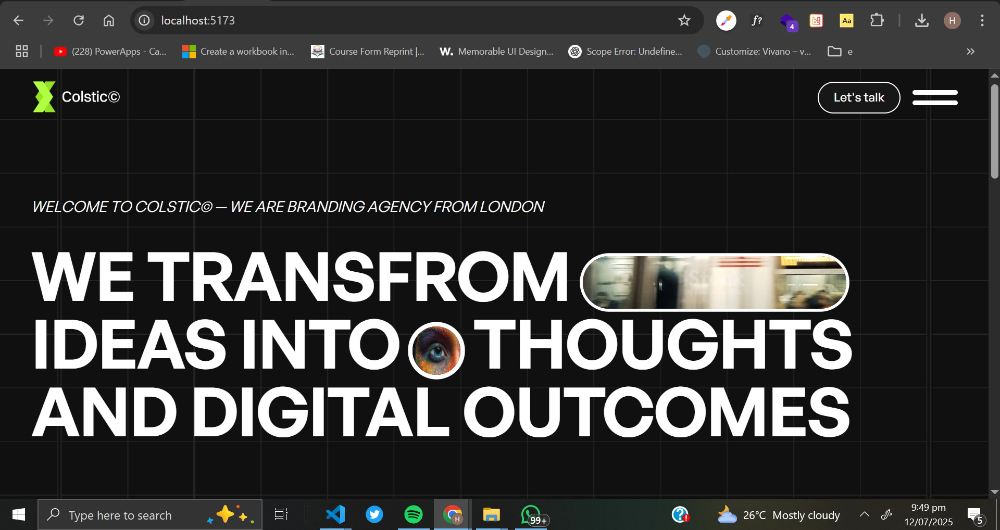

# ✨ Animated Landing Page with React, Tailwind CSS & GSAP

Welcome to the **Animated Landing Page** built with cutting-edge frontend technologies! This project combines the power of **React**, the utility-first styling of **Tailwind CSS**, and the magic of **GSAP** animations to create a smooth, engaging user experience.

<br />

## 🚀 Live Demo

> 🌐 [View Live Demo](https://your-live-site-link.com)  
> *(Replace with your actual deployed URL)*

<br />

## 📸 Preview


  
*(Replace with a GIF or screenshot showcasing the animations)*

<br />

## 🔧 Tech Stack

| Technology      | Description                                  |
|-----------------|----------------------------------------------|
| ⚛️ React        | Component-based UI development               |
| 🎨 Tailwind CSS | Rapid styling with utility-first classes     |
| ✨ GSAP         | High-performance animations and transitions  |

<br />

## 💡 Features

- 📱 **Responsive Design** – Seamlessly adapts across screen sizes  
- ⚡ **Smooth Animations** – Scroll and hover effects powered by GSAP  
- 🔁 **Reusable Components** – Modular, maintainable code structure  
- 🎯 **Performance-Optimized** – Lazy-loaded assets and optimized rendering

<br />

## 🧩 Project Structure

```bash
src/
├── components/       # Reusable UI components
├── assets/           # Images, videos, and static content
├── hooks/            # Custom React hooks (if any)
├── styles/           # Tailwind configuration or global styles
├── App.jsx
└── main.jsx
